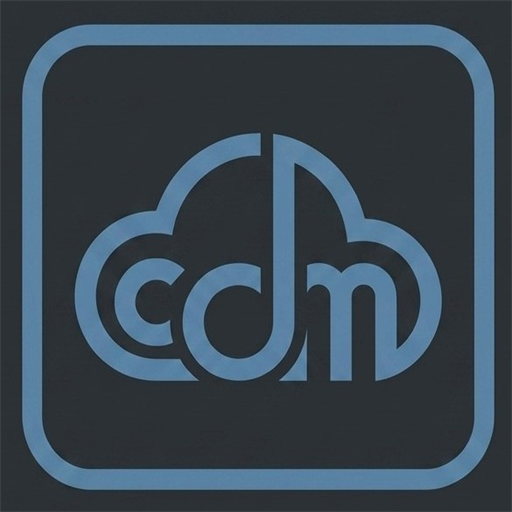

# ☁️ CloudMe - Personal Cloud Storage & Photos Auto-Backup

<p align="center">
  
  <br>
  <b>Lightweight, Fast, Self-Hosted Cloud Storage & Google Photos Alternative</b>
  <br>
  <i>Berjalan lancar di Windows & Linux tanpa beban, hemat RAM, dan mendukung Auto-Backup HP Android.</i>
</p>

<p align="center">
  
  
  
  
</p>

---

## ✨ Fitur Unggulan

### 1. 📂 Google Drive-Style File Management
* **Grid & List View:** Tampilan kartu thumbnail dinamis dan tabel detail berkas.
* **Operasi Lengkap:** Buat Folder, Ganti Nama (*Rename*), Pindahkan (*Move*), Beri Bintang (*Starred*), dan Sampah (*Trash/Restore*).
* **Chunked & Resumable Upload:** Unggah file besar berukuran GB tanpa takut gagal saat koneksi terputus.
* **Streaming ZIP Download:** Pilih banyak berkas dan unduh langsung dalam format `.zip` secara *streaming* instan tanpa membebani disk server.
* **In-Browser File Preview:** Pemutar Video HTML5 (*seekable/streaming*), Pemutar Musik, Viewer Foto resolusi tinggi, Pembaca Dokumen PDF, dan Editor/Viewer Teks.
* **Pencarian Cepat:** Temukan file dan folder secara instan berdasarkan nama dan tipe berkas.

### 2. 📸 Google Photos-Style Timeline & Auto-Backup
* **Photos Timeline View:** Galeri visual foto dan video yang otomatis dikelompokkan berdasarkan **Hari, Bulan, dan Tahun**.
* **Ekstraksi Data EXIF:** Membaca otomatis tanggal asli pengambilan foto, resolusi, dan model kamera.
* **Deduplikasi Cerdas (SHA-256):** Foto/video yang sama tidak akan diunggah dua kali, menghemat ruang penyimpanan dan kuota jaringan.

### 3. 🔐 Secure Sharing & QR Code
* **Link Berbagi Publik:** Bagikan file atau folder ke siapa saja dengan tautan aman.
* **Proteksi Password & Expiration:** Atur kata sandi akses dan batas waktu kedaluwarsa tautan.
* **Instant QR Code:** Generate QR Code otomatis untuk di-scan langsung lewat kamera HP di jaringan lokal maupun internet.

### 4. 👥 Multi-User Management & Admin Panel
* **Manajemen Pengguna:** Admin dapat membuat akun baru, mengedit kuota penyimpanan per user, mengubah role, atau me-reset password.
* **System Monitor:** Pemantauan penggunaan Resource (CPU, RAM, dan Kapasitas Disk) secara real-time.
* **Activity & Security Logs:** Catatan riwayat aktivitas login dan operasi berkas.

### 5. 📱 Ekosistem Mobile & Android
* **WebDAV Support (`/webdav`):** Kompatibel dengan aplikasi auto-sync Android seperti **FolderSync** atau **AutoSync** untuk backup otomatis di background (saat dicas/terhubung Wi-Fi).
* **Progressive Web App (PWA):** Dapat di-install langsung dari browser Chrome/Edge di HP atau Desktop.
* **Dedicated Android App (Capacitor):** Tersedia proyek Android native dan alur otomatis build APK via **GitHub Actions CI/CD**.

### 6. ⚡ Super Ringan & Berkinerja Tinggi
* **SQLite dengan Mode WAL (Write-Ahead Logging):** *Zero-configuration*, konkurensi tinggi, dan sangat hemat sumber daya (hanya menggunakan ~25–45 MB RAM).
* **Cross-Platform:** Berjalan di Windows, Linux (Ubuntu, Debian, dsb.), dan Docker.

---

## 🚀 Cara Menjalankan Server

### 🌟 Opsi 1: 1-Click Windows Server (Disarankan untuk Windows)
Tersedia skrip otomatis yang mendeteksi port bebas dan menjalankan server sebagai **background service 24/7** (tetap berjalan walau terminal ditutup dan otomatis hidup kembali saat PC restart):

1. Klik dua kali file **`deploy-server.bat`**.
2. Skrip akan otomatis:
   - Memeriksa dependensi Node.js.
   - Mendeteksi ketersediaan port (mencari port 8080/8081/dst. yang kosong).
   - Menyiapkan service background menggunakan PM2.
   - Menampilkan alamat IP lokal & Wi-Fi untuk diakses dari HP.

> 🔄 **Untuk Memperbarui Server di Kemudian Hari:**
> Cukup klik dua kali **`update-server.bat`**. Skrip akan otomatis menarik kode terbaru dari GitHub (`git pull`), menginstal dependensi baru, dan me-restart server tanpa merusak data/database Anda.

---

### Opsi 2: Menggunakan Node.js Manual (Windows & Linux)

1. Pastikan **Node.js (versi 18+)** sudah terpasang.
2. Jalankan perintah instalasi dan start:
   ```bash
   # Install dependensi
   npm install

   # Jalankan server
   npm start
   ```
   * *Di Windows:* Kamu juga bisa klik ganda file `run.bat`.
   * *Di Linux:* Jalankan `./run.sh`.

3. Buka browser di alamat:
   ```
   http://localhost:8080
   ```

---

### Opsi 3: Menggunakan Docker / Docker Compose

Cukup jalankan:
```bash
docker compose up -d
```
Aplikasi akan langsung berjalan di port `8080` dan data tersimpan aman di folder `./data`.

---

## 📱 Membangun Aplikasi Android (APK)

Proyek ini mendukung pembuatan aplikasi Android berbasis Capacitor:

### Cara A: Download Otomatis via GitHub Actions (Tanpa Install SDK di PC)
1. Setiap kali Anda melakukan push atau membuat tag rilis di GitHub, workflow [`.github/workflows/build-apk.yml`](.github/workflows/build-apk.yml) akan otomatis mengompilasi file APK.
2. Unduh file APK siap pakai dari tab **Actions** atau halaman **Releases** di repositori GitHub Anda.

### Cara B: Build Lokal di Komputer
Jika Anda memiliki JDK 17 dan Android SDK di komputer:
1. Klik dua kali file **`build-apk.bat`** (atau jalankan `npm run sync && cd android && gradlew assembleDebug`).
2. File APK akan dihasilkan di folder `android/app/build/outputs/apk/debug/app-debug.apk`.

---

## 🛠️ Panduan Instalasi Pertama Kali (Web Setup Wizard)

Saat pertama kali membuka `http://localhost:8080` (atau port yang terkonfigurasi), Anda akan disambut oleh **Web Setup Wizard**:
1. Masukkan **Username & Email Administrator**.
2. Buat **Password Admin**.
3. Tentukan **Folder Penyimpanan** (Default: `./data/storage`).
4. Tentukan **Kapasitas Kuota Default** (Default: 50 GB).
5. Klik **"Selesaikan Instalasi & Masuk"**.

---

## 📲 Panduan Auto-Backup Foto Android (FolderSync)

1. Unduh aplikasi **FolderSync** (Gratis) dari Google Play Store di HP Android.
2. Buka FolderSync $\rightarrow$ Masuk ke menu **Accounts** $\rightarrow$ Tambah Akun **WebDAV**:
   * **Server URL:** `http://[IP-KOMPUTER-ANDA]:8080/webdav` *(Contoh: `http://192.168.1.10:8080/webdav`)*
   * **Username:** Username CloudMe Anda
   * **Password:** Password CloudMe Anda
3. Buat **Sync Filter / Folderpair**:
   * **Akun:** WebDAV CloudMe
   * **Folder HP:** `DCIM/Camera` atau `Pictures`
   * **Tipe Sinkronisasi:** *To remote account (Upload)*
   * **Jadwal:** Pilih *Saat terhubung ke Wi-Fi* dan *Saat HP sedang di-cas (Charging)*.
4. Selesai! Semua foto yang Anda ambil di HP akan otomatis dicadangkan ke CloudMe dan tampil di menu **"Foto & Video"** sesuai tanggal pengambilannya.

---

## 📂 Struktur Direktori Proyek

```
Cloudme/
├── android/               # Proyek Android Native (Capacitor)
├── data/                  # Database SQLite (cloudme.db) & Storage berkas
├── public/                # Frontend Web & Assets (HTML, CSS, JS, Icons)
├── scripts/               # Helper scripts (deploy & setup otomatis)
├── server/                # Backend API Express & WebDAV
│   ├── middleware/        # JWT Authentication & Permission check
│   ├── routes/            # API Endpoints (files, photos, shares, admin, auth)
│   ├── db.js              # Inisialisasi SQLite WAL & skema tabel
│   ├── index.js           # Server entrypoint
│   └── webdav.js          # WebDAV Server Engine
├── .github/workflows/     # CI/CD otomatis (Build Android APK)
├── deploy-server.bat      # 1-Click deploy Windows 24/7 (PM2)
├── update-server.bat      # 1-Click update dari GitHub
├── build-apk.bat          # 1-Click local Android APK builder
└── docker-compose.yml     # Konfigurasi container Docker
```

---

## 📄 Lisensi
Didistribusikan di bawah lisensi **MIT**. Bebas digunakan dan dimodifikasi untuk kebutuhan pribadi maupun komersial.
